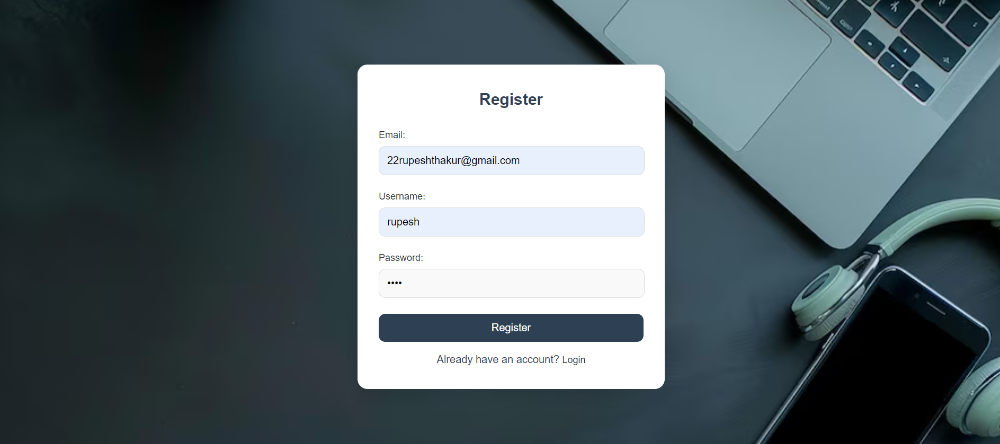
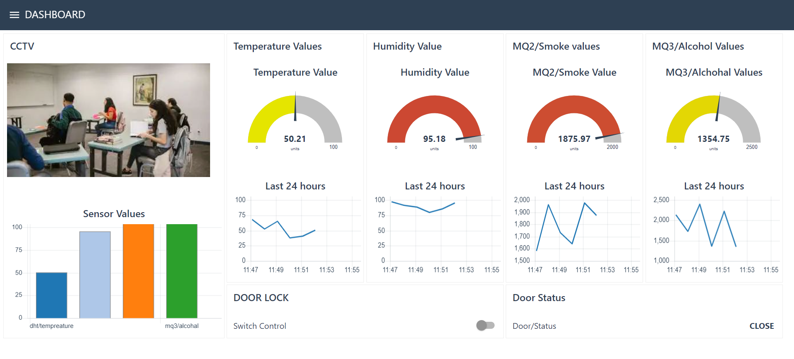
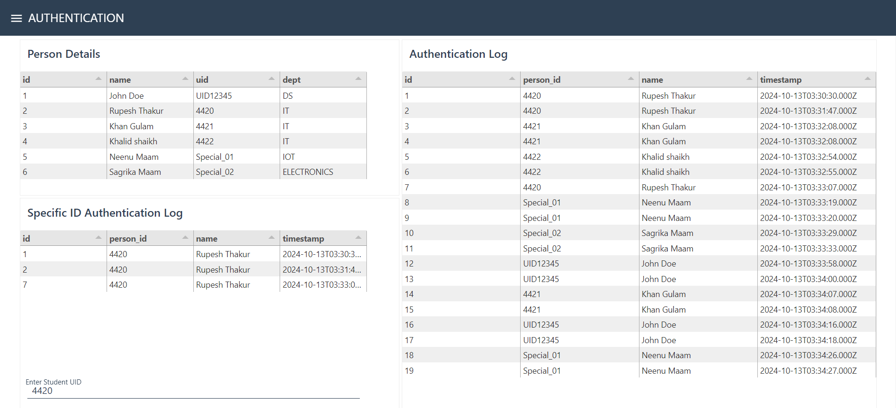
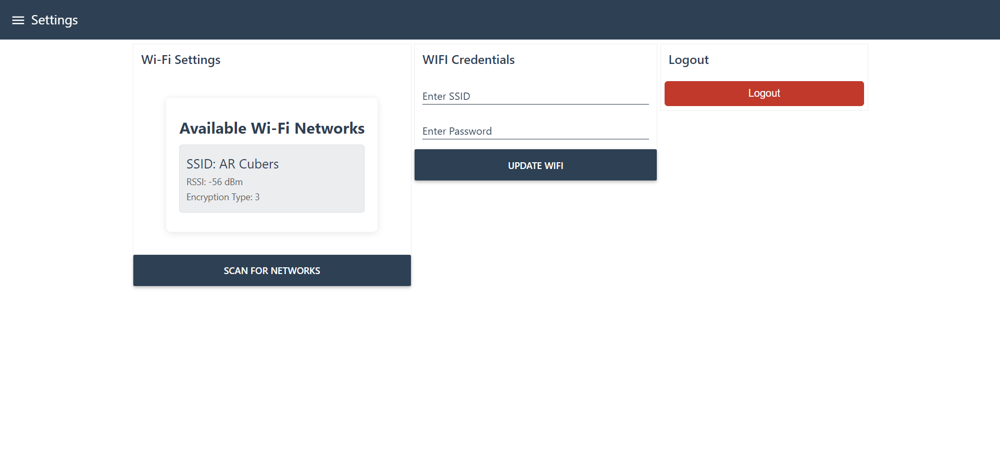
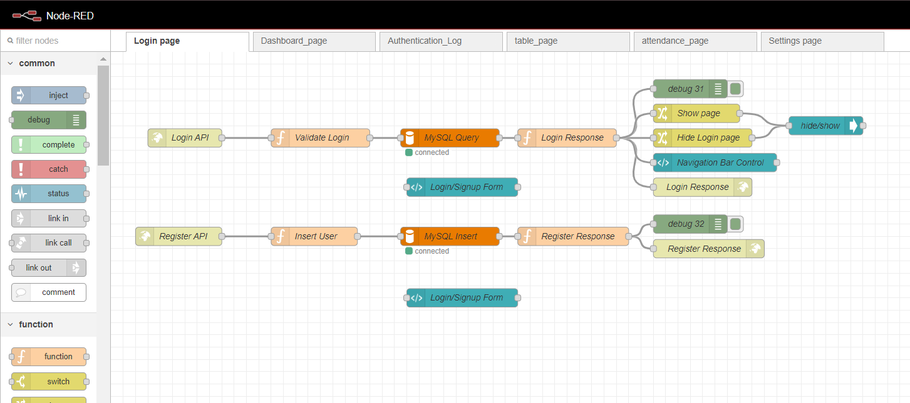
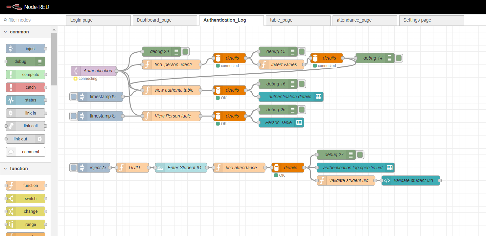

# 🔐 IoT-Based Security & Surveillance System using ESP32

A smart, real-time **IoT-based security and surveillance system** powered by **ESP32**. It features biometric and RFID authentication, live environmental monitoring, secure MQTT-based data handling, and a Node-RED dashboard with Telegram alert integration.

---

## 🚀 Features

- 📶 Wi-Fi-enabled ESP32 communication
- 🔐 RFID + Fingerprint based multi-factor access control
- 🌡️ Real-time temperature, humidity, smoke & gas monitoring
- 📊 Node-RED dashboard for live sensor data and logs
- 🔒 Relay-based solenoid lock control
- 📨 Telegram bot alerts for unauthorized access
- 📺 LCD for local status display
- 🎥 ESP32-CAM for visual surveillance
- ⚙️ Task scheduling via FreeRTOS

---

## 🌐 Technologies Used

- **Microcontroller**: ESP32 (Dual-core with Wi-Fi)
- **Sensors**: DHT22, MQ2, MQ3, Reed Switch
- **Security Modules**: MFRC522 RFID, R307 Fingerprint
- **Interface**: 16x2 I2C LCD Display
- **Actuators**: Relay Module, Solenoid Lock, Buzzer
- **Networking**: MQTT (Mosquitto), WiFi, Telegram Bot
- **Visualization**: Node-RED dashboard
- **Firmware**: Arduino C++, FreeRTOS

---

## 🛠️ Individual Component Wiring

### 📚 DHT22 Sensor – Temperature & Humidity

| Pin       | ESP32 GPIO | Description              |
|-----------|-------------|--------------------------|
| VCC       | 3.3V        | Power                    |
| GND       | GND         | Ground                   |
| OUT       | GPIO 4      | Data signal              |

---

### 🔥 MQ2 Gas Sensor – Smoke/Flammable Gas Detection

| Pin       | ESP32 GPIO | Description              |
|-----------|-------------|--------------------------|
| VCC       | 5V          | Power                    |
| GND       | GND         | Ground                   |
| A0        | GPIO 15     | Analog smoke data        |

---

### 🧪 MQ3 Sensor – Alcohol/LPG Detection

| Pin       | ESP32 GPIO | Description              |
|-----------|-------------|--------------------------|
| VCC       | 5V          | Power                    |
| GND       | GND         | Ground                   |
| A0        | GPIO 18     | Analog gas data          |

---

### 🚪 Reed Switch – Door Status

| Pin       | ESP32 GPIO | Description              |
|-----------|-------------|--------------------------|
| VCC       | 3.3V or 5V  | Power                    |
| GND       | GND         | Ground                   |
| REED_OUT  | GPIO 27     | Door open/close status   |

---

### 🔔 Buzzer – Audio Alerts

| Pin                | ESP32 GPIO | Description        |
|--------------------|-------------|--------------------|
| + (Positive)       | GPIO 26     | Buzzer signal pin  |
| - (Ground)         | GND         | Ground             |

---

### 🔒 Relay Module – Door Lock Control

| Pin   | ESP32 GPIO | Description         |
|--------|-------------|---------------------|
| VCC    | 5V          | Power               |
| GND    | GND         | Ground              |
| IN1    | GPIO 19     | Trigger signal pin  |

---

### 📘 I2C LCD Display – 16x2 I2C

| Pin   | ESP32 GPIO | Description       |
|--------|-------------|-------------------|
| VCC    | 5V          | Power             |
| GND    | GND         | Ground            |
| SDA    | GPIO 21     | I2C Data          |
| SCL    | GPIO 22     | I2C Clock         |

---

### 🛂 WS1850S RFID Module: for Access Control. (I2C Mode)

| Pin   | ESP32 GPIO | Description        |
|--------|-------------|--------------------|
| VCC    | 3.3V        | Power              |
| GND    | GND         | Ground             |
| SDA    | GPIO 21     | I2C Data           |
| SCL    | GPIO 22     | I2C Clock          |

> 🔸 *Note: Some MFRC522 modules use SPI. Adjust pins if you're using SPI instead.*

---

### ✋ R307 Fingerprint Sensor

| R307 Pin | ESP32 GPIO | Description                     |
|----------|-------------|---------------------------------|
| VCC      | 3.3V or 5V  | Power                           |
| GND      | GND         | Ground                          |
| TX       | GPIO 17     | Fingerprint TX → ESP32 RX       |
| RX       | GPIO 16     | Fingerprint RX ← ESP32 TX       |

---

## 🧠 MQTT Topics

**Publish:**
- `dht/tempreature`  
- `dht/humidity`  
- `mq2/smoke`  
- `mq3/alcohal`  
- `door/status`  
- `Door/authentication`  
- `User/unauthorized`  
- `wifi/scan`  

**Subscribe:**
- `home/door_lock`  
- `wifi/update`  
- `wifi/scan/request`  
- `telebot/msg`  

---

## 📸 Node-RED Dashboard & Flow Previews

### 🔐 Login Interface  


### 📊 Dashboard  


### 🧾 Authentication Logs  


### ⚙️ Settings Panel  


### 🔄 Login Flow  


### 📡 Dashboard Flow  


### 🔒 Authentication Flow  


---
## 🤖 Telegram Bot Setup using BotFather

To enable Telegram notifications or bot control, follow these steps to create and configure a bot using **BotFather**:

### ✅ Steps to Create a Telegram Bot

1. **Open Telegram App**
   Ensure you are logged in via the mobile or desktop app.

2. **Search for BotFather**
   Find `@BotFather` in Telegram and open the verified account.

3. **Start the Conversation**
   Click **Start** or send the command:

   ```
   /start
   ```

4. **Create a New Bot**
   Send the command:

   ```
   /newbot
   ```

   Follow the prompts:

   * **Name your bot** (e.g., `MySecurityBot`)
   * **Username** must end with `bot` (e.g., `myhome_alert_bot`)

5. **Copy the Bot Token**
   After creation, BotFather provides a token like:

   ```
   123456789:ABCDefghIJKlmnoPQRstuVWxyz
   ```

   **Save this token securely** – it will be used in your code to interact with Telegram’s API.

6. **Customize Your Bot (Optional)**
   You can personalize your bot with the following BotFather commands:

   * `/setuserpic` – Upload profile picture
   * `/setdescription` – Short description
   * `/setabouttext` – Bio/about text
   * `/setcommands` – List available commands

7. **Set Bot Commands**
   Use `/setcommands` in BotFather and define the following commands:

   ```
   /status – Current system state
   /lock – Lock the door
   /unlock – Unlock the door
   /sensors – Sensor data report
   ```

8. **Start the Bot**
   Search for your bot username in Telegram and press **Start** to activate it.

9. **Get Your Chat ID**
   To send messages to yourself or a group:

   * Send a message to your bot
   * Open this URL in your browser (replace `<TOKEN>`):

     ```
     https://api.telegram.org/bot<TOKEN>/getUpdates
     ```
   * Find the `chat.id` in the response JSON. Use it in your code to send messages.

## 🤖 Telegram Bot Commands

- `/status` – Current system state  
- `/lock` – Lock the door  
- `/unlock` – Unlock the door  
- `/sensors` – Sensor data report

---

## 👤 Author

**Rupesh H. Thakur**  
🎓 BSc.IT Student, Thakur College of Science and Commerce  
🔗 [GitHub – @Rupesh6786](https://github.com/Rupesh6786)  
📧 Email: 55rupeshthakur@gmail.com  

---

## 📄 License

This project is licensed under the **MIT License**.  
See the [LICENSE](LICENSE) file for more information.

---

> Smart homes and industries begin with smart security.  
> Designed with automation, cloud, and real-time intelligence at its core.

